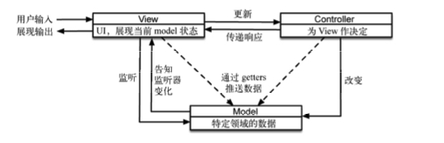
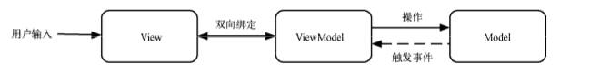
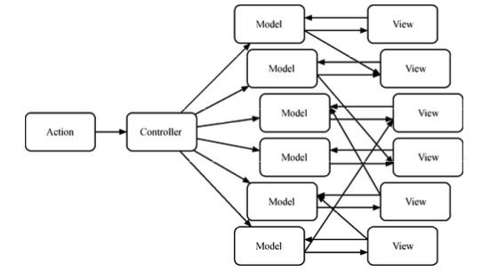
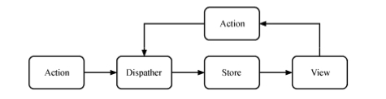
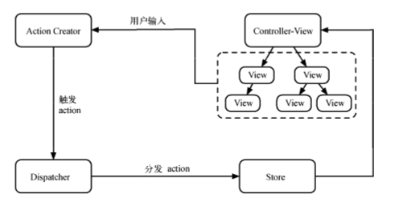

# 4. Flux 架构模式

## 4.1 MVC/MVVM

### MVC

1. Model

    Model 负责保存应用数据，和后端交互同步应用数据，或校验数据。
    Model 不涉及用户界面，也不涉及表示层，而是代表应用程序可能需要的独特形式的数据。 当 Model 改变时，它会通知它的观察者(如视图)作出相应的反应。
    总的来说，Model 主要与业务数据有关，与应用内交互状态无关。

2. View
   M
   View 是 Model 的可视化表示，表示当前状态的视图。前端 View 负责构建和维护 DOM 元素。 View 对应用程序中的 Model 和 Controller 的了解是有限的，更新 Model 的实际任务都是在 Controller 上。

3. Controller

    负责连接 View 和 Model，Model 的任何改变会应用到 View 中，View 的操作会通过 Controller
    应用到 Model 中。

总结就是：用户与页面产生交互的时候，Controller 中的事件触发器就开始工作了，通过调用 Model 层，来完成对 Model 的修改，然后 Model 层再去通知 View 层更新。

### MVVM

VM(ViewModel)代替了 C(Controller)。其关键 “改进” 是数据绑定(DataBinding)，也就是说，View 的数据状态发生变化可以直接影响 VM。

### MVC 的问题

项目越来越大、逻辑越来越复杂的时候就非常明显，数据流动会很混乱。

## 4.3 Flux

Flux 的核心思想就是数据和逻辑永远单向流动。

### 基本概念

Flux 应用由 3 大部分组成——dispatcher、store 和 view

Flux 中心化控制让所有的请求与改变都只能通过 action 发出，统一由 dispatcher 来分配。好处是 View 可以保持高度简洁，它不需要关心太多的逻辑，只需要关心传入的数据;中心化还控制了所有数据，发生问题时可以方便查询。比起 MVC 架构下数据或逻辑的改动可能来自多个完全不同的源头，Flux 架构追查问题的复杂度和困难度显然要小得多。
