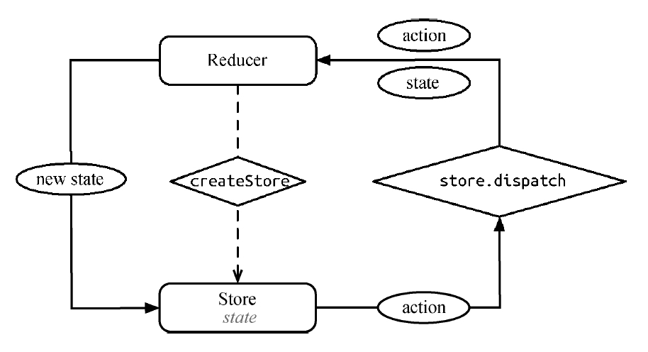
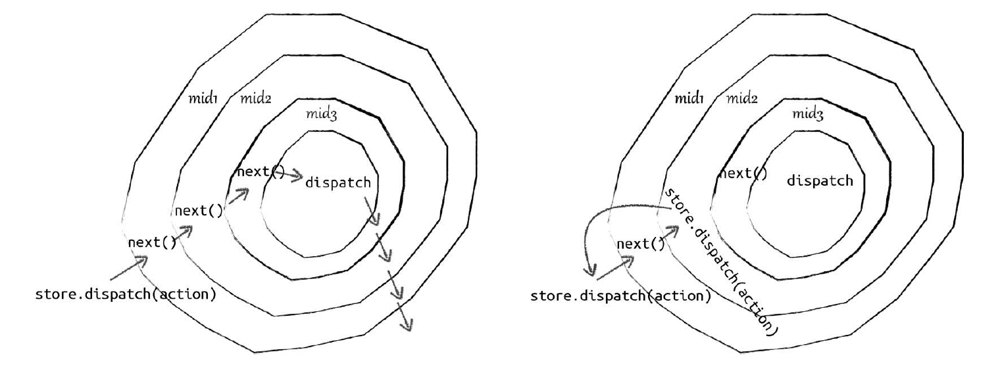

# 5. 深入 Redux 应用架构

## 5.1 简介

从设计上看，Redux 参考了 Flux 的设计，但是对 Flux 许多冗余的部分（如 dispatcher）做了简化，同时将 Elm 语言中函数式编程的思想融合其中。



Redux 三大原则：

1. 单一数据源
2. 状态是只读的
3. 只能通过纯函数来修改状态

## 5.2 Redux middleware

middleware 是一种对 Redux 应用进行自由组合、插拔的插件机制，它允许开发者在 action 被 reducer 处理之前对其进行拦截、修改和记录。

每一个 middleware 处理一个相对独立的业务需求，通过串联不同的 middleware 实现变化多样的功能。

源码示例：

```js
import compose from './compose';
export default function applyMiddleware(...middlewares) {
    return next => (reducer, initialState) => {
        let store = next(reducer, initialState);
        let dispatch = store.dispatch;
        let chain = [];
        var middlewareAPI = {
            getState: store.getState,
            dispatch: action => dispatch(action),
        };
        chain = middlewares.map(middleware => middleware(middlewareAPI));
        dispatch = compose(...chain)(store.dispatch);
        return {
            ...store,
            dispatch,
        };
    };
}
```

logger middleware 的实现：

```js
export default store => next => action => {
    console.log('dispatch:', action);
    next(action);
    console.log('finish:', action);
};
```

1. 函数式编程思想设计

middleware 是一个层层包裹的匿名函数，这其实是函数式编程中的 currying，它是一种使用匿名单参数函数来实现多参数函数的方法。applyMiddleware 会对 logger 这个 middleware 进行层层调用，动态地将 store 和 next 参数赋值。currying 的 middleware 结构的好处主要有以下两点：

-   易串联：currying 函数具有延迟执行的特性，通过不断 currying 形成的 middleware 可以累积参数，再配合组合（compose）的方式，很容易形成 pipeline 来处理数据流。
-   共享 store：在 applyMiddleware 执行的过程中，store 还是旧的，但是因为闭包的存在，applyMiddleware 完成后，所有的 middleware 内部拿到的 store 是最新且相同的。

2. 给 middleware 分发 store

每个 middlewares 都会持有 store 的方法。

```js
const middlewareAPI = {
    getState: store.getState,
    dispatch: action => dispatch(action),
};
chain = middlewares.map(middleware => middleware(middlewareAPI));
```

3. 组合串联 middleware

compose 是函数式编程中的组合，它将 chain 中的所有匿名函数 [f1, f2, ... , fx, ..., fn] 组装成一个新的函数。

```js
dispatch = compose(...chain)(store.dispatch);

function compose(...funcs) {
    return arg => funcs.reduceRight((composed, f) => f(composed), arg);
}
```

当 compose 执行完后，我们得到的 dispatch 是这样的，假设 n = 3：

```js
dispatch = f1(f2(f3(store.dispatch))));
```

这时调用新 dispatch，每一个 middleware 就依次执行了。

4. 在 middleware 中调用 dispatch 会发生什么

middleware 中可以调用 store.dispatch() 或者 next()，这两者有区别吗？

```js
// 调用 next
const logger = store => next => action => {
    console.log('dispatch:', action);
    next(action);
    console.log('finish:', action);
};
```

middleware 中调用 next()，效果是进入下一个 middleware。

```js
// 调用 store.dispatch
const logger = store => next => action => {
    console.log('dispatch:', action);
    store.dispatch(action);
    console.log('finish:', action);
};
```

middleware 使用 store.dispatch 来分发 action，就发生了右图所示的情况，这相当于重新来一遍。假如这个 middleware 一直简单粗暴地调用 store.dispatch(action)，就会形成无限循环了。



**既然这样调用 store.dispatch 有什么作用呢？**

假如我们需要发送一个异步请求到服务端获取数据，成功后弹出一个自定义的 message。这里会用到了 Redux Thunk：

```js
const thunk = store => next => action =>
    typeof action === 'function'
        ? action(store.dispatch, store.getState)
        : next(action);
```

Redux Thunk 会判断 action 是否是函数。如果是，则执行 action，否则继续传递 action 到下一个 middleware。针对于此，我们设计了以下 action：

```js
const getThenShow = (dispatch, getState) => {
    const url = 'http://xxx.json';
    fetch(url)
        .then(response => {
            dispatch({
                type: 'SHOW_MESSAGE_FOR_ME',
                message: response.json(),
            });
        })
        .catch(() => {
            dispatch({
                type: 'FETCH_DATA_FAIL',
                message: 'error',
            });
        });
};
```

调用 store.dispatch(getThenShow)，Redux Thunk 就会执行 getThenShow 方法。getThenShow 会先请求数据，如果成功，分发一个显示 message 的 action；否则，分发一个请求失败的 action。而这里的 dispatch 就是通过 Redux Thunk middleware 传递进来的。

## 5.3 Redux 异步流

1. redux-thunk

Thunk 函数实现上就是针对多参数的 currying 以实现对函数的惰性求值。任何函数，只要参数有回调函数，就能写成 Thunk 函数的形式

源代码：

```js
function createThunkMiddleware(extraArgument) {
    return ({dispatch, getState}) =>
        next =>
        action => {
            if (typeof action === 'function') {
                return action(dispatch, getState, extraArgument);
            }
            return next(action);
        };
}
```

2. redux-promise

源代码：

```js
import {isFSA} from 'flux-standard-action';
function isPromise(val) {
    return val && typeof val.then === 'function';
}
export default function promiseMiddleware({dispatch}) {
    return next => action => {
        if (!isFSA(action)) {
            return isPromise(action) ? action.then(dispatch) : next(action);
        }
        return isPromise(action.payload)
            ? action.payload.then(
                  result => dispatch({...action, payload: result}),
                  error => {
                      dispatch({...action, payload: error, error: true});
                      return Promise.reject(error);
                  }
              )
            : next(action);
    };
}
```

3. redux-saga

用 generator 替代 promise 实现异步流控制。

## 5.4 Redux 与路由

**React Router**

提供声明式路由配置，以及嵌套路由、路径匹配和参数传递。

**React Router Redux**

结合 Redux 和 React Router，路由状态保存在 Redux store 中，通过 dispatch 触发路由跳转。

```js
import { push } from 'react-router-redux';
// 切换路由到 /home
store.dispatch(push('/home'));
```

