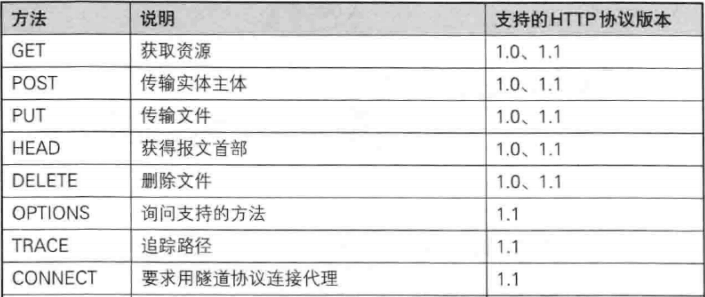

# 2. HTTP 协议

## 2.1 通信

HTTP 用于客户端和服务器之间的通信。

## 2.2 请求和响应

请求必定由客户端发出，而服务器端回复响应。

请求报文是由请求方法、请求 URI、协议版本、（可选）请求首部组成和内容实体构成的。

响应报文由协议版本、状态码、解释状态码的原因短语、（可选）响应首部和内容实体构成。

## 2.3 无状态

HTTP 是一种不保存状态，即无状态(stateless)协议，对于发送过的请求或响应都不做持久化处理。如果期望保持状态，需要用到 Cookie 技术。

## 2.4 URI 定位资源

HTTP 协议使用 URI 定位互联网上的资源。

## 2.5 HTTP 方法

**GET：获取资源**

GET 方法用来请求访问已被 URI 识别的资源。

**POST：传输实体主体**

POST 方法用来传输实体。

**PUT：传输文件**

PUT 方法用来传输文件，但是鉴于 HTTP/1.1 PUT 方法自身不带验证机制，任何人都可以上传文件，存在安全性问题，因此一般网站都不使用该方法。若配合 Web 应用程序的验证机制，或架构设计采用 REST 标准的同类 Web 网站，就可能会开发该方法。

**HEAD：获得报文首部**

HEAD 方法和 GET 一样，只是不返回报文主体部分。用于确认 URI 的有效性及资源更新的日期时间等。

**DELETE：删除文件**

DELETE 方法用来删除文件，与 PUT 相反。HTTP/1.1 DELETE 与 PUT 一样不带验证机制。

**OPTIONS：询问支持的方法**

OPTIONS 方法用来查询针对请求 URI 指定的资源支持的方法。

**TRACE：追踪路径**

TRACE 方法是让 Web 服务器将之前的请求通信环回给客户端的方法。

发送请求时，在 Max-Forwards 守护填入一个数值，每经过一个服务端会将该数字减 1，当数值为 0 时，就停止传输，最后的服务器返回 200 OK 的响应。

客户端通过该方法可以查询发送出去的请求是怎样被加工修改/篡改的。这是因为，请求目标服务器可能会通过代理中转，TRACE 方法就是用来确认连接过程中发生的一系列操作。

但是，TRACE 方法本来不常用，再加上它容易引发 XST（跨站追踪），通常不会用到。

**CONNECT：要求用隧道协议连接代理**

CONNECT 方法要求与代码服务器通信时简历隧道，实现用跟随单协议进行 TCP 通信。主要使用 SSL 和 TLS 协议把通信内容加密后经过网络隧道传输。

## 2.6 使用方法下达命令

HTTP/1.0 和 HTTP/1.1 支持的方法

## 2.7 持久连接节省通信量

HTTP 协议初始版本，每次 HTTP 通信就要断开一次 TCP 连接。浏览一个包含多张图片的 HTML 页面，在发送访问 HTML 页面资源的同时，也会请求该页面里包含的其他资源。因此每次请求都会造成无谓的 TCP 连接和断开，增加通信量的开销。

### 2.7.1 持久连接

为了解决上述问题，HTTP 1.1 增加了持久连接（也称 HTTP keep-alive 或 HTTP connection reuse）。特点是，只要任意一端没有明确断开连接，则保持 TCP 连接状态。

持久连接的好处在于减少了 TCP 连接的重复建立和断开连接造成的额外开销，减轻了服务端的负载。

### 2.7.3 管线化

持久连接使得多数请求以管线化方式发送成为可能。从前发送请求后需等待并收到响应，才可以发送下一个请求。管线化出现后，不用等待响应亦可直接发送下一个请求，这样同时并行发送多个请求。

## 2.8 使用 Cookie 的状态管理

HTTP 是无状态协议，不对之前发生过的请求和响应状态进行管理。不可否认，无状态有它的有点。不必保存状态，自然可减少服务器的 CPU 及内存资源的消耗。

Cookie 技术通过在请求和响应报文中写入 Cookie 信息来控制客户端的状态。Cookie 会根据从服务器端发送的响应报文内的一个叫做 Set-Cookie 的 首部字段信息，通知客户端保存 Cookie。当下次客户端再往该服务器发送请求时，客户端会自动在请求报文中加入 Cookie 值后发送出去。
